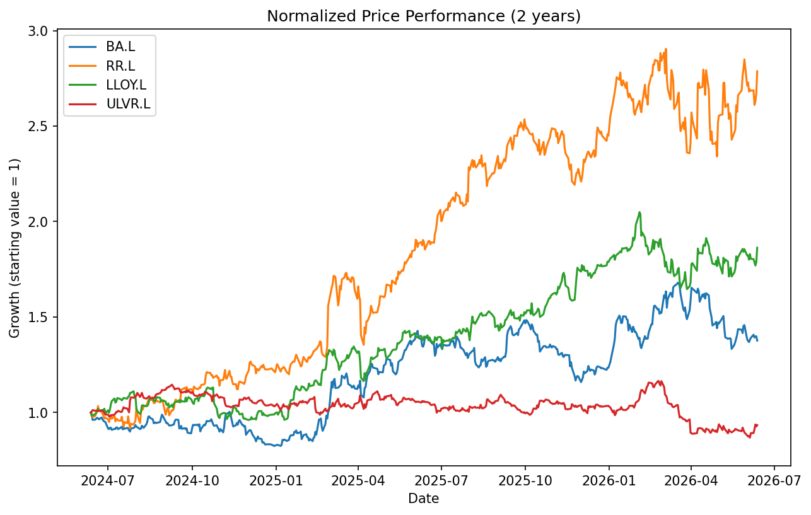
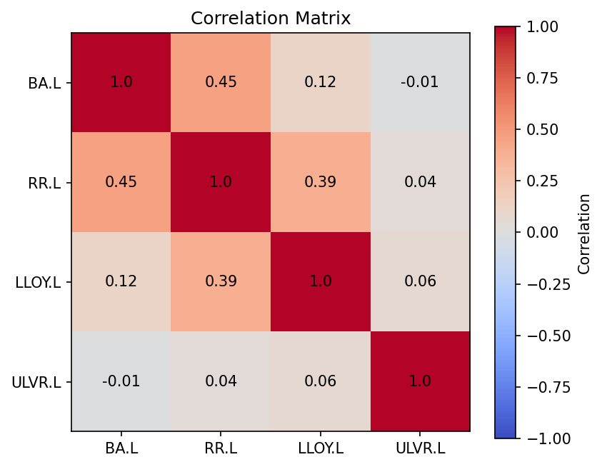

## Stock Portfolio Risk & Return Analysis

I analszed 2 years of price data for four UK-listed companies (BAE Systems, Rolls-Royce, Lloyds, Unilever) using Python (pandas, yfinance, matplotlib).

**Key findings:**
- Annualised volatility ranged from 18.85% (Unilever) to 36.77% (Rolls-Royce), broadly matching expectations — defensive consumer stocks (Unilever) showed lower volatility than cyclical/aerospace stocks (Rolls-Royce, BAE).
- Correlation analysis showed Unilever moved almost independently of the other three stocks (correlation near 0), while BAE/Rolls-Royce/Lloyds showed moderate positive correlation (0.39-0.45).
- An equal-weighted portfolio of all four stocks had an annualized volatility of just 18.52% — lower than any individual stock — demonstrating the diversification effect.
- The portfolio's annualized return was 27.95%, giving a Sharpe ratio of 1.29, indicating strong risk-adjusted performance over this period.

**What I learned:** This project gave me hands-on experience with pandas data manipulation, financial calculations (returns, volatility, Sharpe ratio), correlation analysis, and data visualization — concepts I'd previously only encountered in theory.

| Stock | Annualized Volatility |
|-------|----------------------|
| BA.L  | 30.98% |
| RR.L  | 36.77% |
| LLOY.L| 26.94% |
| ULVR.L| 18.85% |
| **Portfolio** | **18.52%** |

**Portfolio annual return:** 27.95% | **Sharpe ratio:** 1.29
